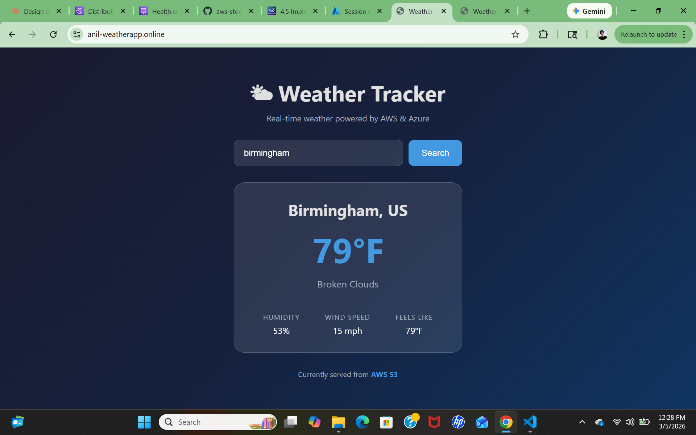
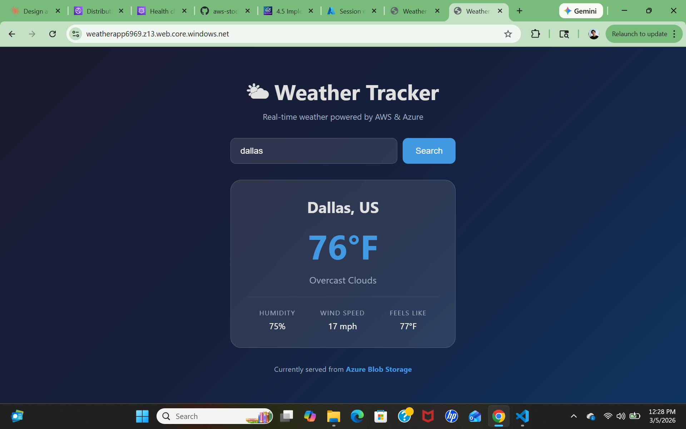
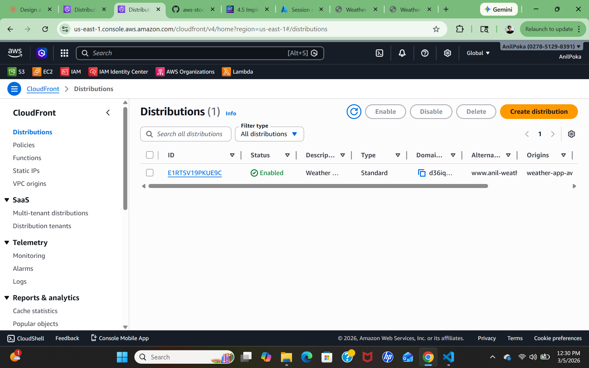
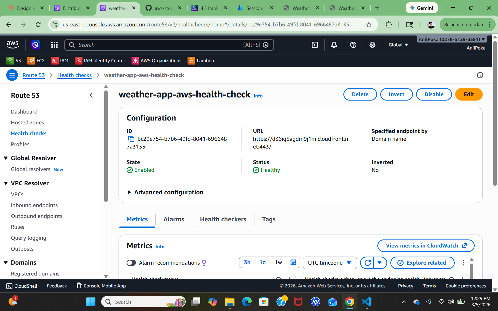
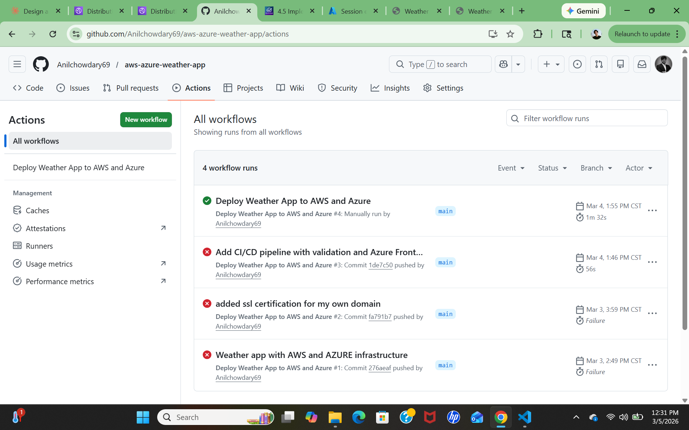

# Multi-Cloud Weather Application with Disaster Recovery

A real-time weather application deployed simultaneously on AWS and Azure with automated disaster recovery, CI/CD pipeline, and infrastructure managed entirely with Terraform.

**Live:** [www.anil-weatherapp.online](https://www.anil-weatherapp.online)

---

## What This Project Does

A fully functional weather app that fetches real-time weather data for any city in the world. The app runs on two clouds simultaneously — AWS as the primary and Azure as the failover. Route 53 health checks monitor AWS every 30 seconds and automatically switch traffic to Azure if AWS goes down. The entire infrastructure is deployed and managed with Terraform across both cloud providers.

---

## Live Demo

| Endpoint | URL | Cloud |
|---|---|---|
| Primary | https://www.anil-weatherapp.online | AWS CloudFront |
| Azure Direct | https://weatherapp6969.z13.web.core.windows.net | Azure Blob Storage |
| CloudFront Direct | https://d36iq5agdm9j1m.cloudfront.net | AWS CloudFront |

### App Screenshots



---

## Architecture


---

## Features

**Real-time weather data** — connects to OpenWeatherMap API and displays temperature, humidity, wind speed, and feels like for any city worldwide.

**Multi-cloud deployment** — identical app deployed on both AWS S3 and Azure Blob Storage simultaneously. Both clouds serve live traffic.

**Disaster recovery** — Route 53 health checks ping CloudFront every 30 seconds. Three consecutive failures trigger automatic DNS failover to Azure. Maximum downtime: 60 seconds.

**Dynamic cloud detection** — the app footer automatically detects which cloud is serving it and displays "Currently served from AWS S3" or "Currently served from Azure Blob Storage".

**CI/CD pipeline** — GitHub Actions automatically validates and deploys to both clouds on every push to main. CloudFront cache is invalidated after every deployment.

**Infrastructure as Code** — all 25+ resources across AWS and Azure defined in Terraform. Entire infrastructure deployable with two commands.

**Custom domain with SSL** — live at www.anil-weatherapp.online with HTTPS via ACM certificate and CloudFront.

---

## AWS Infrastructure

| Resource | Name | Purpose |
|---|---|---|
| S3 Bucket | weather-app-aws-33454 | Hosts weather app files |
| CloudFront | E1RTSV19PKUE9C | CDN — delivers app globally |
| ACM Certificate | anil-weatherapp.online | Free SSL certificate |
| Route 53 Hosted Zone | anil-weatherapp.online | DNS management |
| Route 53 Health Check | weather-app-aws-health-check | Monitors CloudFront every 30s |
| Route 53 Primary Record | www.anil-weatherapp.online | Points to CloudFront |
| Route 53 Secondary Record | app.anil-weatherapp.online | Points to Azure failover |

### CloudFront Distribution


### Route 53 Health Check


## Azure Infrastructure

| Resource | Name | Purpose |
|---|---|---|
| Resource Group | weather-app-rg | Container for all Azure resources |
| Storage Account | weatherapp6969 | Hosts weather app files |
| Blob Storage | $web container | Static website hosting |

---

## How the Failover Works

Route 53 runs a health check against the CloudFront endpoint every 30 seconds over HTTPS. The health check is configured with a failure threshold of 3 — meaning CloudFront must fail 3 consecutive checks before failover triggers. This prevents false alarms from brief network blips.

When failover triggers Route 53 switches the DNS record from CloudFront to Azure Blob Storage. The TTL on the secondary record is set to 60 seconds — meaning DNS servers around the world refresh their cached answer within 1 minute and start routing users to Azure.

When CloudFront recovers Route 53 detects the health check passing again and automatically switches back to AWS. No manual intervention required.

**Production improvement:** For true automatic DNS failover between AWS and a non-AWS endpoint I would use AWS Global Accelerator which supports anycast IP failover across cloud providers. Route 53 DNS failover has a type conflict limitation between alias A records for CloudFront and CNAME records for Azure endpoints on the same DNS name.

---

## CI/CD Pipeline

Every push to main triggers the pipeline automatically:

### Validate Stage
1. Check all required app files exist
2. Verify API key is configured in app.js
3. Terraform format check
4. Terraform validate

### Deploy Stage (only runs if validate passes)
5. Configure AWS credentials from GitHub Secrets
6. Login to Azure using service principal
7. Recreate terraform.tfvars from GitHub Secrets
8. Terraform init — connect to S3 remote state
9. Terraform plan — preview changes
10. Terraform apply — deploy to both clouds
11. Invalidate CloudFront cache

# pipeline success
[](pipeline-success.png)
---

## Security

| Secret | Purpose |
|---|---|
| AWS_ACCESS_KEY_ID | AWS authentication |
| AWS_SECRET_ACCESS_KEY | AWS authentication |
| AZURE_CREDENTIALS | Azure service principal JSON |
| AZURE_SUBSCRIPTION_ID | Azure subscription |
| CLOUDFRONT_DISTRIBUTION_ID | Cache invalidation after deploy |

All credentials stored as encrypted GitHub Secrets. Never hardcoded in code. `terraform.tfvars` is in `.gitignore` and recreated dynamically in the pipeline.

---

## Terraform Remote State

State stored in S3 backend so the pipeline always knows what exists in both clouds:

```
s3://stock-market-terraform-state-6969/weatherapp/terraform.tfstate
```

---

## How to Deploy

**Prerequisites:**
- AWS CLI configured
- Azure CLI configured and logged in
- Terraform installed
- OpenWeatherMap API key

**Deploy:**
```bash
git clone https://github.com/Anilchowdary69/aws-azure-weather-app.git
cd aws-azure-weather-app/terraform
terraform init
terraform apply
```

Everything deploys in under 10 minutes. CloudFront takes the longest at 3-5 minutes.

---

## Challenges and Lessons Learned

**DNS type conflict between AWS and Azure endpoints:** Route 53 requires an alias A record for CloudFront but only allows CNAME records for Azure Blob Storage. You cannot have both an A record and CNAME on the same DNS name. Solved by using separate subdomains — `www` for primary AWS and `app` for Azure failover. In production AWS Global Accelerator solves this with anycast IP failover.

**Azure account restrictions:** Anderson University Azure account had RBAC restrictions blocking storage access and CLI operations. Switched to personal Pay As You Go account with full permissions.

**CloudFront caching stale files:** After updating app files CloudFront served old cached versions. Fixed by running cache invalidation after every deployment — automated in the CI/CD pipeline.

**Azure storage account globally unique naming:** Azure storage account names must be globally unique across all Azure subscriptions worldwide. No dashes allowed. Fixed by using a unique number suffix.

**Terraform state in CI/CD:** Without remote state every pipeline run starts blind and tries to recreate existing resources. Fixed by configuring S3 backend — same pattern used in Project 2.

---

## Cost

| Resource | Monthly Cost |
|---|---|
| S3 Static Website | ~$0.01 |
| CloudFront | ~$0.01 |
| Route 53 Hosted Zone | $0.50 |
| Route 53 Health Check | $0.50 |
| Azure Blob Storage | ~$0.01 |
| Domain (amortized) | ~$0.08 |
| **Total** | **~$1.11/month** |

---

## Author

Built as part of a cloud engineering portfolio demonstrating multi-cloud architecture, disaster recovery design, Infrastructure as Code, and CI/CD automation across AWS and Azure.
